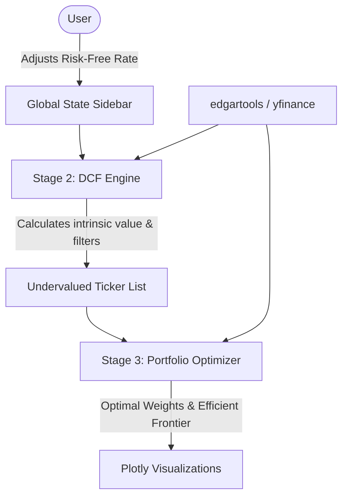

# Integrated Finance Application (Capstone)

## The Problem
Standalone valuation screens and portfolio optimizers are disjointed. An analyst cannot stress-test how a shift in a global macro variable (like interest rates) ripples down through individual firm valuations and ultimately dictates the optimized portfolio allocation strategy.

## Success Looks Like
A unified Streamlit app emphasizing "cross-component sensitivity":
1. The user adjusts a global "Risk-Free Rate" slider from the main sidebar.
2. The WACC updates automatically, recalculating all DCF intrinsic valuations.
3. Overvalued assets are strictly and dynamically removed from a defined universe of tickers.
4. The remaining undervalued assets form the *new* investment universe and are piped to `PyPortfolioOpt`.
5. An Efficient Frontier and optimized allocation based purely on the "Value-Based" subset are visualized via Plotly.

## How We'd Know We're Wrong
- We lose reactivity: if changing the RFR slider is agonizingly slow or requires clunky state handling, the "cross-component sensitivity" fails the UX test.
- The pipeline breaks down on edge cases: e.g., PyPortfolioOpt crashes because 0 stocks survive the DCF filter. We need explicit fail-safes. 

## Building On
- **Project 1:** DCF models, WACC via CAPM, `edgartools` data sourcing.
- **Project 2:** `PyPortfolioOpt` integration, `yfinance` fetching, Efficient Frontier visualization.
- **Streamlit:** Extracting state into `st.session_state` to decouple page rerenders from shared data logic.

## The Unique Part
**Integration Pattern A (Value-Based Portfolio):** A structural bridge tying an absolute fundamental valuation constraint (DCF Margin of Safety) directly to a relative allocation optimization (Modern Portfolio Theory Max Sharpe).

## Tech Stack
- **UI & Architecture:** Streamlit (Global Sidebar, Session State)
- **Data Sourcers:** `edgartools` (SEC filings), `yfinance` (market data)
- **Math & Finance Engine:** `PyPortfolioOpt`, `numpy`, `pandas`
- **Visualization:** Plotly (2D Sensitivity Heatmaps, Efficient Frontier)

## System Context

