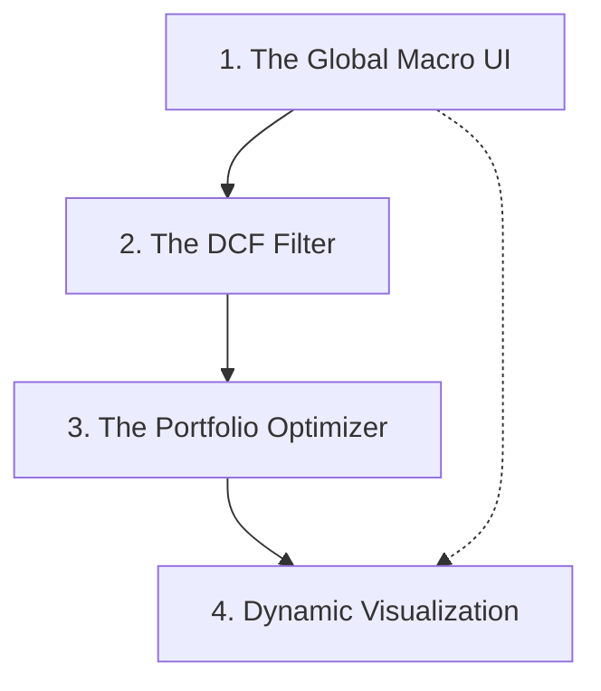

# Roadmap

Building on: **Integration Pattern A** (Project 1 DCF Filter + Project 2 PyPortfolioOpt)

## Sections

### 1. The Global Macro UI
Build the Streamlit sidebar containing the structural inputs: list of 5-15 tickers, a global "Risk-Free Rate" slider (1% to 10%), a "Market Risk Premium" slider, and a "Max Weight per Stock" slider.

### 2. The DCF Filter (Project 1 Integration)
Build the valuation engine using `edgartools` to compute WACC dynamically from the global Risk-Free Rate, output Intrinsic Value vs. Current Price, and strictly filter for "Undervalued" stocks.

### 3. The Portfolio Optimizer (Project 2 Integration)
Build the `PyPortfolioOpt` engine that takes ONLY the surviving undervalued tickers, calculates sample covariance/expected returns using `yfinance`, and runs the Max Sharpe optimization.

### 4. Dynamic Visualization
Generate the Plotly Efficient Frontier and optimized allocation weights using the surviving assets, ensuring the entire chain recalculates reactively when the global Risk-Free Rate slider is adjusted.

## Dependencies

_Build order: Start with sections that have no incoming arrows._
